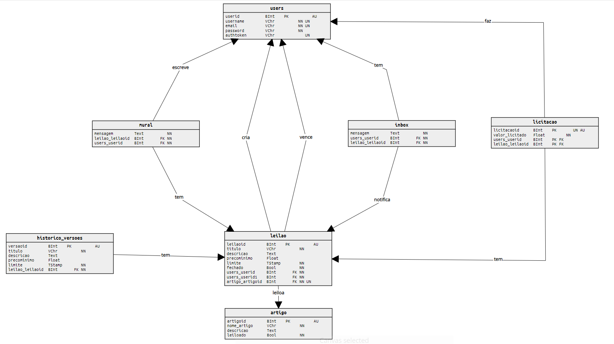

# *Lights, Camera, Auction* :clapper:

***Lights, Camera, Auction*** is the name of our API, which pretends to manage an auction's ecosystem where people create an account, create their auctions, and sell their goods to someone who's interested in them.

___

## Used Technologies :computer:

  

___

## ER Diagram


## RDM Diagram



___

## How to run it :running:

:warning: **Keep all the files and directories as they are, otherwise, is not guaranteed it works.**

:warning: **Create a *.env* file and a *.env.example* file with the following content: `SECRET=`*your secret***


:floppy_disk: First of all you'll need to build a ***nodejs*** package with some dependencies, so you must run:

- `npm init -y`

- `npm install express body-parser pg-promise jest axios jsonwebtoken dotenv-safe`

:atm: Now you may be able to deploy it, do it running `node server`.

:vertical_traffic_light: You can also test it with `npm run test`, however, not all tests are implemented.

:earth_americas: Make it public with `./ngrok http 8080 -host-header="localhost:8080"`

___

## RULES :clipboard:

1) Each user session has a timeout of 1 hour. Then you have to login once again.

2) Each user has a unique *username* and *email*.

3) An auction can be created without a minimum price, in this case, the default value will be 0.

4) Once auctioned, a product cannot be auctioned again, until the auction ends without any bid.

5) Only the seller has the permission to edit his own auctions.

6) Anybody can bid an auction, except the owner.

7) Only bid above maximum bid are accepted.

8) If it's the first bid, the amount must be above minimum price.

9) The owner of an auction receives notifications about all the messages written in his auctions, including his owns.

10) Any user can clear his entire notification inbox.


___

## Getting Started :baby:

After the server is deployed, you can now create an account.

```rest
POST http://localhost:8080/dbproj/user

body:
{
    "username": "John",
    "password": "test123",
    "email": "john123@gmail.com"
}
```

An then login.

```rest
PUT http://localhost:8080/dbproj/user

body:
{
  "username": "John",
  "password": "test123"
}
```

When you're successfully logged in, you may have access to the entire system.

A token is given to you, :warning: save it because you won't receive another one within an hour! 

- Logout
```rest
PUT http://localhost:8080/dbproj/user/logout

headers:
{
    "authtoken": "yourtoken123"
}
```

- Create an Auction
```rest
POST http://localhost:8080/dbproj/leilao

headers:
{
    "authtoken": "yourtoken123"
}

body:
{
	"titulo": "yourtitle", 
	"descricao": "yourdescription",
	"precoMinimo": 1, (is not a must)
	"limite": "2020/5/31:22:00",
	"artigoId": 1
}
```

- List All Running Auctions
```rest
GET http://localhost:8080/dbproj/leiloes

headers:
{
    "authtoken": "yourtoken123"
}
```

- List All Running Auctions By Product ID Or Product Description
```rest
GET http://localhost:8080/dbproj/leiloes/?keyword=

queries:
{
    "keyword": "yourkeyword"
}

headers:
{
    "authtoken": "yourtoken123"
}
```

- List Auction By Its ID
```rest
GET http://localhost:8080/dbproj/leiloes/?leilaoId=

queries:
{
    "leilaoId": "yourauctionId"
}

headers:
{
    "authtoken": "yourtoken123"
}
```

- List All User Activity
```rest
GET http://localhost:8080/dbproj/user/atividade

headers:
{
    "authtoken": "yourtoken123"
}
```

- Make a Bid
```rest
GET http://localhost:8080/dbproj/leiloes/?leilaoId=&licitacao=

queries:
{
    "leilaoId": "yourauctionId",
    "licitacao": "yourbid"
}

headers:
{
    "authtoken": "yourtoken123"
}
```

- Edit An Auction
```rest
PUT http://localhost:8080/dbproj/leilao/?leilaoId=

queries:
{
    "leilaoId": "yourauctionId"
}

headers:
{
    "authtoken": "yourtoken123"
}

body:
{
    "titulo": "yourtitle",
    "descricao": "yourdescription",
	"limite": "yourdate",
	"precominimo": 19.99
}
```

- Write a Message In a Auction Mural
```rest
POST http://localhost:8080/dbproj/leilao/mural/?leilaoId=

queries:
{
    "leilaoId": "yourauctionId"
}

headers:
{
    "authtoken": "yourtoken123"
}

body:
{
    "message": "yourmessage"
}
```

- Check User Inbox
```rest
GET http://localhost:8080/dbproj/user/inbox

headers:
{
    "authtoken": "yourtoken123"
}
```

- Clear User Inbox
```rest
DEL http://localhost:8080/dbproj/user/inbox

headers:
{
    "authtoken": "yourtoken123"
}
```

- List All Products
```rest
GET http://localhost:8080/dbproj/artigos

headers:
{
    "authtoken": "yourtoken123"
}
```

___


## **Contributors** :sparkles:

<html><i><b> Licenciatura em Engenharia Informática - Universidade de Coimbra<br>
Bases de Dados - 2020/2021 <br>
Coimbra, 31 de maio de 2021
</b></i></html>

:mortar_board: Diogo Flórido

:mortar_board: ***[Rodrigo Fernando Henriques Sobral](https://github.com/RodrigoSobral2000)***

___

## License :link:
Have a look at the [license file](LICENSE) for details
___
