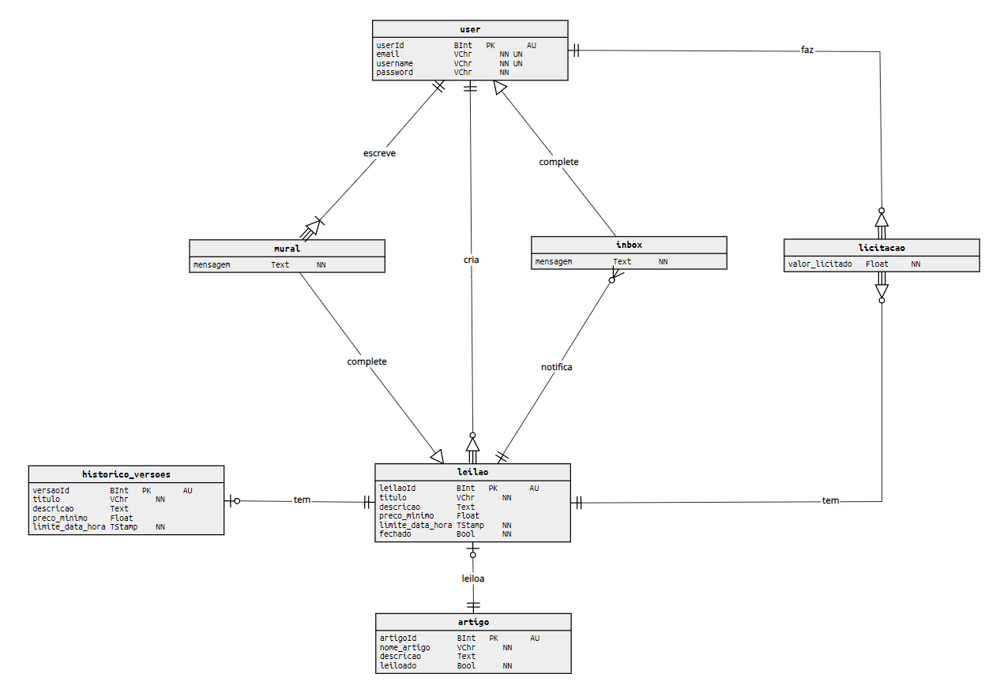

# DataBases Assignment 2021
 
## Relationship Entity Diagram

Below we explain how and why we built this RE structure

:one: Users

We started building users subsystem. 

So we decided to separate `buyers` and `sellers` because both are able to do different things, a `seller`, for example, is able to create several auctions (at leasts one, otherwise he isn't even considered a seller), by other side, `buyer` can bid several auctions (at least one too, for the same reason as the previous one). However, they still being descended entities from `user`, which means a `user` can be simultaneously a `seller` and a `buyer`, that's why, plus redundancy avoidance, whe used a `complete inheritance`.

:two: Auction

After that, we implemented `auction` and its involved entities.

An `auction` is created by one and only one `seller` and must have a biding `product` associated. In other words, an `auction` existance doesn't make sense without a `product`, so `product` is a weak entity.

:three: Biddings

Associated to each `auction`, there's a bidding `history`. Is here where every `biddings` are stored and can be consulted later (even there's no one).

Each `bidding` contains the propused value, the `buyer` ID and the corresponding `history` ID, which belongs to a certain `auction`.

:four: Messages & Notifications

One more thing it was proposed, was to build a notification ecosystem relationated to `auctions` and general `users`. 

To do that, we decided to firstly create a `mural` where all `users` can post (or not) several `messages`. Besides that, `buyers` who had an overlaid `bid`, had to (once again, or not) receive a `message` (once again, or several) warning them. So we created an `inbox`, which works like a bridge between `users` and `messages` from `auctions`.