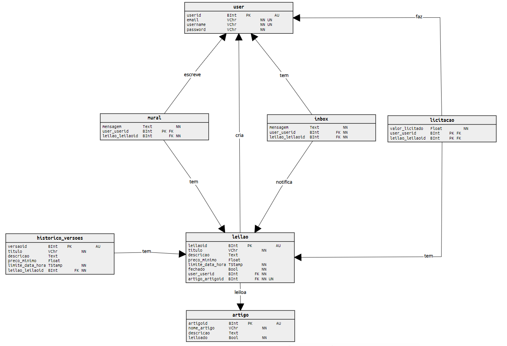

# DataBases Assignment 2021
___

# *Lights, Camera, Auction* :clapper:

***Lights, Camera, Auction*** is the name of our API, which pretends to manage an action ecosystem where people create an account, create an auction, and sell their goods to someone who's interested in them.

___

## Used Technologies :computer:

1. ***Python (3.8.5)***
2. ***Flask* Web Framework**
3. ***PostgreSQL*** 
4. ***Visual Studio Code***

___

## Relationship Entity Diagram

Below we explain how and why we built this RE structure

:one: Users

We started building users subsystem. 

So we decided to create one single entity `users` because both are able to create and bid several auctions. The only problem this may cause (and must be fixed in the "coding part") is when an `user` tries to bid his own auction (he must be forbidden to do it).

:two: Auction

After that, we implemented `auction` and its involved entities.

An `auction` is created by one and only one `user` and must have a `product` associated, an `version_history` to stored the previous versions of that `auction` and a `mural` (we'll approach this one in the next topics).

The `version_history` has several `auctions` with the same ID, so it has to have its own ID to identify each version, that's why it is not a weak entity, compared to `auction`.

:three: Biddings

Associated to each `auction`, there's a bidding history. Is here where every `biddings` are stored and can be consulted later (even there's no one).

Each `bidding` contains the propused value, the buyer ID and the corresponding `auction` ID, which belongs to a certain `user`.

:four: Messages & Notifications

One more thing it was proposed, was to build a notification ecosystem relationated to `auctions` and `users`. 

To do that, we decided to firstly create like two communications bridges:
1. `users` -> `mural` -> `auction`
1. `auction` -> `inbox` -> `users`

So, `users` have an associated `inbox` (identified by users ID) where several messages can be written by `auctions` (*aka* notifications) and, same way, `auctions` have an associated `mural` (identified by auctions ID) where several messages can be written by `users`.

___
## Database Management :books:

Database Main Operations:
- Insertions `(insert into ...)`
- Consultations `(select ... from ...)`
- Editions `(alter table ...)`

Conflicts Solutions:
- When an **insertion** or **edition** is made in the database, a **commit** must be done after it's completed.
- For now, we don't think there's no need to even lock tables, since there are few common data manipulations in the checklist presented below.
- As we can see, the majority of the tasks are about listings and consultations, this is, data readings, so we won't have many data conflits.

___
## Initial Plan - CheckList :brain: :clipboard:

Task | Responsable | Done
-- | -- | --
Registo de utilizadores. | Rodrigo | :heavy_check_mark:
Autenticação de utilizadores. | Rodrigo | :x:
Criar um novo leilão. | Diogo | :x:
Listar todos os leilões existentes. | Diogo | :x:
Pesquisar leilões existentes. | Diogo | :x:
Consultar detalhes de um leilão. | Diogo | :x:
Listar todos os leilões em que o utilizador tenha atividade. | Diogo | :x:
Efetuar uma licitação num leilão. | Rodrigo | :x:
Editar propriedades de um leilão. | Diogo | :x:
Escrever mensagem no mural de um leilão. | Rodrigo | :x:
Entrega imediata de notificações a utilizadores. | Rodrigo | :x:
Notificação de licitação ultrapassada. | Rodrigo | :x:
Término do leilão na data, hora e minuto marcados. | Diogo | :x:

___

## **Contributors** :sparkles:

<html><i><b> Licenciatura em Engenharia Informática - Universidade de Coimbra 
Bases de Dados - 2020/2021  
Coimbra, 16 de abril de 2021
</b></i></html>

:mortar_board: Diogo Flórido - uc2018282583@student.uc.pt	

:mortar_board: ***[Rodrigo Fernando Henriques Sobral](https://github.com/RodrigoSobral2000)*** - uc2018298209@student.uc.pt

___

## License :link:
Have a look at the [license file](LICENSE) for details
___
